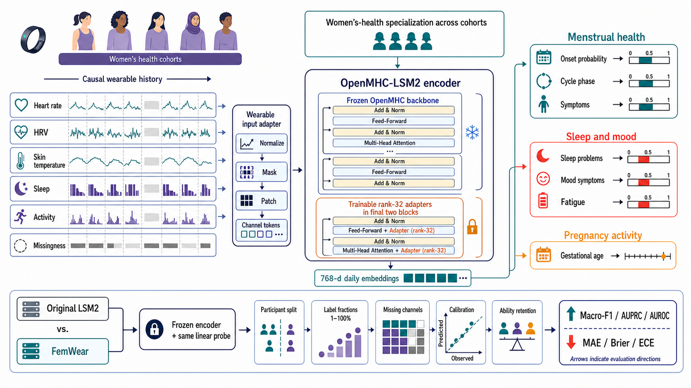

# FemWear

Research code for **FemWear: A Specialized Wearable Foundation Model for Women's Health**. FemWear parameter-efficiently specializes the public [OpenMHC](https://github.com/AshleyLab/OpenMHC) wearable foundation encoder for heterogeneous women's-health research tasks while preserving a frozen native OpenMHC inference path.

> **Research prototype.** This repository supports reproducible research on cohort-level wearable prediction. It is not a diagnostic, treatment-selection, or unsupervised clinical-deployment system.

## Overview



*FemWear is a hardware-agnostic specialization layer: causal wearable histories are mapped to 768-dimensional daily embeddings by a frozen OpenMHC-LSM2 backbone with trainable rank-32 adapters. The figure summarizes supported research task families and participant-level evaluation protocols; it is not a clinical decision diagram or a device-specific ring implementation.*

## What FemWear implements

FemWear retains the pretrained OpenMHC LSM2 patch projection and Transformer encoder, then adds lightweight specialization components:

- Semantic sensor alignment for activity, heart rate, heart-rate variability, sleep, temperature, oxygen variation, light, and related modalities.
- Rank-32 residual adapters in the final two encoder blocks: 239,236 trainable encoder parameters (1.11% of the 21.54M-parameter backbone).
- A causal longitudinal state model with task-family routing and partial-label multitask losses, so a cohort contributes only labels it actually observes.
- Coherent 24-hour and 72-hour menstrual-onset probabilities, calibrated with train-only temperature scaling.
- A frozen native branch for OpenMHC ability-retention tasks and an adapted branch for women's-health task families.

The current codebase includes data interfaces, training scripts, participant-level evaluation protocols, probability calibration, missing-history checks, capacity-matched baselines, and test coverage for the major modeling components.

## Evidence snapshot

The current paper evaluates six cohorts with 63 comparable primary metrics, including 33 women's-health metrics, and retains the 32-task OpenMHC ability-retention benchmark. On the prespecified fixed participant development split over three seeds, FemWear showed selected menstrual-task improvements:

| Endpoint | Metric | OpenMHC | FemWear | Relative change |
| --- | --- | ---: | ---: | ---: |
| Cycle phase | Macro-F1 | 0.4162 | 0.4500 +/- 0.0397 | +8.15% |
| Onset within 24 h | AUPRC | 0.0843 | 0.0813 +/- 0.0138 | -3.40% |
| Onset within 72 h | AUPRC | 0.2002 | 0.2027 +/- 0.0345 | +1.81% |
| Cramps | MAE | 1.0268 | 0.9306 +/- 0.0155 | +9.32% |
| Mood symptoms | MAE | 1.4301 | 1.3465 +/- 0.0252 | +5.80% |
| Sleep problems | MAE | 1.4405 | 1.3048 +/- 0.0986 | +9.43% |

The stricter 42-participant nested leave-one-participant-out audit retained positive trends for 24-hour onset (+2.87%), 72-hour onset (+6.35%), and cramps (+2.19%), but not for cycle phase, mood, or sleep. No endpoint had a strictly positive multiplicity-corrected confidence interval. Capacity-matched experiments outperformed a latest-day MLP, but did not establish a stable advantage over matched GRU or MMoE baselines. These boundaries are part of the result, not omitted caveats.

## Repository layout

```text
src/femmhc/        Core model, adapters, objectives, task heads, and data interfaces
scripts/           Data preparation, training, evaluation, aggregation, and plotting entry points
configs/           Versioned experiment configurations
tests/             Unit and regression tests
third_party/OpenMHC/  Pinned OpenMHC submodule
artifacts/         Local-only caches, checkpoints, logs, and generated results
processed/         Local-only processed datasets
```

## Installation

Clone recursively so that the pinned OpenMHC dependency is available:

```powershell
git clone --recurse-submodules https://github.com/YifanWang-China/FemMHC.git
Set-Location FemMHC
python -m venv .venv
.\.venv\Scripts\Activate.ps1
python -m pip install --upgrade pip
python -m pip install -r requirements.txt
python -m pip install -e "third_party/OpenMHC[lsm2,hf]"
$env:PYTHONPATH = "$PWD\src;$PWD\third_party\OpenMHC\src"
```

The original experiments used an NVIDIA RTX 5090 D GPU. The CUDA/PyTorch combination depends on the target system; install a compatible PyTorch build before installing the remaining requirements when needed.

## Data access and preparation

Raw datasets, pretrained weights, participant-level outputs, and checkpoints are deliberately excluded from version control. Obtain each dataset from its original provider and comply with its license and data-use terms.

| Source | Role in this project | Access note |
| --- | --- | --- |
| OpenMHC XS | General wearable representation and ability-retention evaluation | Open source; included as a submodule dependency |
| mcPHASES 1.0.0 | Menstrual phase, onset, symptoms, and hormone-associated tasks | PhysioNet credentialed access required |
| DEPRESS Fitbit / inPHRsym / HRV-sleep | Affective and sleep-related transfer tasks | Use each source's release terms |
| Pregnancy Gestational-Age Clock | Pregnancy activity transfer task | Use the source study's release terms |
| NHANES minute-level activity | Female activity pretraining ablation | Use the original public release terms |

Point preprocessing scripts to local copies; do not put credentials, cookies, data-use agreements, or raw data inside this repository. The restricted-access guide is in [`scripts/restricted_datasets.md`](scripts/restricted_datasets.md).

Examples:

```powershell
python scripts/prepare_mcphases_femmhc.py --help
python scripts/prepare_nhanes_female.py --help
python scripts/prepare_depress_fitbit.py --help
python scripts/prepare_pregnancy_ga_official.py --help
```

## Training and evaluation

Set the Python path once per shell:

```powershell
$env:PYTHONPATH = "$PWD\src;$PWD\third_party\OpenMHC\src"
```

Train the joint women's-health model after preparing local datasets and obtaining the upstream OpenMHC checkpoint:

```powershell
python scripts/train_femmhc_joint.py `
  --architecture dual_path_router `
  --dropout 0 --max-steps 1000 --batch-size 16 --seed 42 `
  --output artifacts/checkpoints/femwear-joint-seed42.pt
```

Evaluate the resulting checkpoint on the development partition:

```powershell
python scripts/evaluate_femmhc_joint.py `
  --checkpoint artifacts/checkpoints/femwear-joint-seed42.pt `
  --output-dir artifacts/benchmark/femwear-joint-seed42-validation `
  --split validation
```

The participant-level menstrual audit and label-efficiency experiment are orchestrated by:

```powershell
.\scripts\run_mcphases_nested_loso_all13.ps1 -Batch 0 -Jobs 4
.\scripts\run_mcphases_nested_loso_all13.ps1 -Batch 1 -Jobs 4
.\scripts\run_mcphases_label_efficiency.ps1 -Batch 0 -Jobs 4
.\scripts\run_mcphases_label_efficiency.ps1 -Batch 1 -Jobs 4
```

Use the YAML files in [`configs/`](configs) to reproduce frozen settings. The main joint-model configuration is [`configs/femmhc_joint_v1.yaml`](configs/femmhc_joint_v1.yaml). Evaluation scripts protect the test split by default; `--allow-test` must be supplied explicitly after model selection is frozen.

## Tests

```powershell
$env:PYTHONPATH = "$PWD\src;$PWD\third_party\OpenMHC\src"
python -m pytest tests -q
```

## Reproducibility and responsible use

- All intended data splits are participant-disjoint; a participant, not a participant-day, is the independent evaluation unit.
- Probabilities are calibrated using training participants only. Calibration improves probability reliability, not necessarily discrimination.
- The central menstrual cohort has 42 participants. The nested audit is internal cross-validation, not external validation.
- FemWear is a specialization of a general wearable foundation encoder. It is not a women-only model pretrained from scratch and does not establish universal superiority across tasks.
- The repository does not redistribute raw data or upstream weights. Respect every source license, access agreement, and consent restriction.

## Citation

An arXiv identifier will be added once the preprint is public. Until then, please cite the repository and the upstream OpenMHC paper and data releases appropriate to the components you use.

## Acknowledgments

FemWear builds on the architecture and released parameters of [AshleyLab/OpenMHC](https://github.com/AshleyLab/OpenMHC). Please cite OpenMHC and all original datasets in downstream work.
