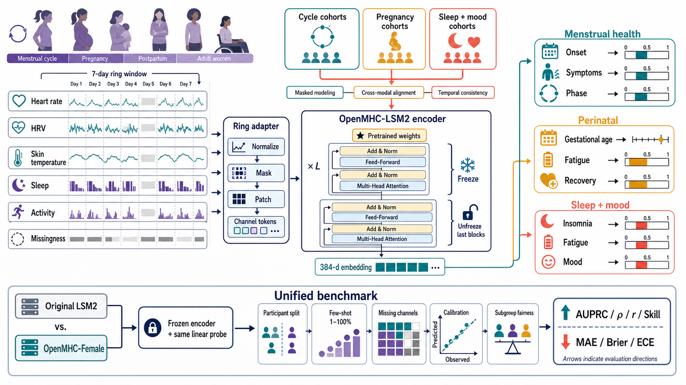

# FemMHC：基于 OpenMHC 的女性穿戴基础模型

FemMHC 在 OpenMHC-LSM2 的通用穿戴表征上进行女性数据持续预训练，并用可变传感器编码、女性生理状态适配器和时间一致的任务头，学习月经健康及次日症状相关表征。

> 当前状态：研究原型。仓库保存模型代码、训练与评估脚本和聚合结果；原始数据、OpenMHC 权重、训练检查点和个体级输出不进入版本控制。



## 核心结果

主要结果来自 mcPHASES 的参与者级划分，使用随机种子 42、43、44。FemMHC 与 OpenMHC 使用相同数据划分和相同任务头；模型选择只使用验证参与者，概率校准只拟合验证集，最终指标在测试参与者上计算。置信区间采用参与者级配对 bootstrap。

### 校准后的嵌套月经开始风险头

| 任务 | 指标 | OpenMHC | FemMHC | 相对改善 | 改善种子数 |
|---|---:|---:|---:|---:|---:|
| 24 小时内月经开始 | AUPRC ↑ | 0.0347 ± 0.0007 | **0.0451 ± 0.0054** | **+30.16%** | 3/3 |
| 24 小时内月经开始 | AUROC ↑ | 0.5228 ± 0.0073 | **0.5839 ± 0.0120** | **+11.72%** | 3/3 |
| 24 小时内月经开始 | Brier ↓ | 0.032039 ± 0.000010 | **0.032002 ± 0.000010** | **+0.12%** | 3/3 |
| 72 小时内月经开始 | AUPRC ↑ | 0.1103 ± 0.0040 | **0.1148 ± 0.0063** | **+4.21%** | 2/3 |
| 72 小时内月经开始 | ECE ↓ | 0.0166 ± 0.0057 | **0.0095 ± 0.0060** | **+43.88%** | 3/3 |
| 72 小时内月经开始 | AUROC ↑ | **0.5760 ± 0.0196** | 0.5731 ± 0.0187 | -0.38% | 1/3 |

嵌套头直接预测三个互斥时间区间：`0–24 h`、`24–72 h` 和 `>72 h`，因此始终满足：

```text
P(月经在 72 小时内开始) ≥ P(月经在 24 小时内开始)
```

测试集中该约束的违反次数为 0。完整校准结果见 [`artifacts/runs/calibrated-onset-three-seed`](artifacts/runs/calibrated-onset-three-seed)。

### 次日症状任务

| 任务 | 指标 | OpenMHC | FemMHC | 相对改善 | 改善种子数 |
|---|---:|---:|---:|---:|---:|
| 次日疲劳严重度 | MAE ↓ | 1.1355 ± 0.0328 | **1.0877 ± 0.0208** | **+4.22%** | 3/3 |
| 次日腹胀严重度 | MAE ↓ | 1.1873 ± 0.0145 | **1.1616 ± 0.0304** | **+2.16%** | 3/3 |
| 次日情绪波动严重度 | MAE ↓ | 1.0499 ± 0.0210 | **1.0352 ± 0.0095** | **+1.40%** | 3/3 |

这些结果是当前公开数据上的内部研究结果，不代表外部临床验证。月经周期阶段、经量和部分激素回归任务尚未超过匹配的 OpenMHC 基线；完整 13 项结果见 [`artifacts/runs/three-seed-summary`](artifacts/runs/three-seed-summary)。

## FemMHC 与 OpenMHC 的区别

OpenMHC 提供跨人群、跨日常活动任务的通用穿戴表征。FemMHC 保留其 LSM2 patch projection 和 Transformer 主干，以参数高效方式加入四层女性任务建模能力：

1. **语义传感器编码**：按传感器名称、模态、单位、身体位置和采样率编码通道，不依赖固定设备通道编号。
2. **女性生理状态适配器**：低秩专家适配器根据每日表征进行软路由；当前训练阶段冻结 OpenMHC 主干。
3. **时间因果训练**：用第 `t` 天的穿戴信号预测第 `t+1` 天症状，避免把未来信息混入输入。
4. **任务族解耦与一致概率**：周期、症状、月经开始风险和激素任务使用独立残差适配器；24/72 小时风险由同一个嵌套头产生，并在验证集上校准。

## 数据

| 数据源 | 当前用途 | 本地处理规模 |
|---|---|---:|
| [OpenMHC](https://github.com/AshleyLab/OpenMHC) XS 女性子集 | 通用表征初始化与女性持续预训练 | 121 名参与者，26,832 个参与者日 |
| [mcPHASES 1.0.0](https://physionet.org/content/mcphases/1.0.0/) | 月经健康迁移、症状和激素任务 | 42 名参与者，5,546 个可用日 |

mcPHASES 使用参与者级固定划分：29 人训练、6 人验证、7 人测试。模型输入包括步数、心率、HRV（RMSSD）、腕温、血氧变化和睡眠状态；标签包括周期阶段、次日症状、经量、月经开始窗口以及尿液激素测量。

数据集受各自许可与访问条款约束，本仓库不重新分发原始数据。

## 方法概览

```text
多源分钟级传感器
        │
        ├─ 语义传感器元数据编码
        ├─ OpenMHC patch projection
        └─ 时间位置编码
                 │
          冻结的 OpenMHC Transformer
                 │
          生理状态低秩专家适配器
                 │
      ┌──────────┼───────────┬──────────┐
    周期头      症状头      嵌套风险头     激素头
                           │
                    验证集向量校准
```

持续预训练目标包括遮蔽 patch 重建、传感器集合一致性、OpenMHC 表征保持和参与者内时间顺序预测。

## 安装

推荐 Python 3.11 和支持 CUDA 的 PyTorch。

```powershell
git clone --recurse-submodules https://github.com/YifanWang-China/FemMHC.git
cd FemMHC

python -m venv .venv
.\.venv\Scripts\Activate.ps1
python -m pip install --upgrade pip
python -m pip install -r requirements.txt
python -m pip install -e ".\third_party\OpenMHC[lsm2,hf]"

$env:PYTHONPATH = "$PWD\src;$PWD\third_party\OpenMHC\src"
```

RTX 50 系显卡可按 `requirements.txt` 中的说明安装匹配的 PyTorch CUDA wheel。OpenMHC 权重未包含在仓库中，请按其项目说明下载，并放到自定义路径。

## 数据预处理

```powershell
python scripts/prepare_mcphases_femmhc.py `
  --archive <path-to-mcphases-1.0.0.zip> `
  --output-dir processed/mcphases `
  --seed 42
```

处理程序会生成参与者划分、每日分钟级数组、标签、上下文和数据模式描述。重复执行默认从已完成的传感器进度继续。

## 训练

### 阶段一：OpenMHC 女性子集持续预训练

```powershell
python scripts/train_femmhc_openmhc_female.py `
  --checkpoint <openmhc-lsm2.ckpt> `
  --openmhc-root <openmhc-xs-root> `
  --output artifacts/runs/seed-42/femmhc-openmhc-female.ckpt `
  --max-steps 5000 --batch-size 4 --seed 42
```

### 阶段二：mcPHASES 因果迁移

```powershell
python scripts/train_femmhc_pretrain.py `
  --checkpoint <openmhc-lsm2.ckpt> `
  --femmhc-init artifacts/runs/seed-42/femmhc-openmhc-female.ckpt `
  --processed-dir processed/mcphases `
  --output artifacts/runs/seed-42/femmhc-mcphases-causal.ckpt `
  --max-steps 3000 --batch-size 2 --seed 42 `
  --self-supervised-weight 1 --supervised-weight 0.5 `
  --keep-periodic-checkpoints
```

`scripts/run_femmhc_seed.ps1` 封装了两阶段训练，但其中的数据路径是本机示例，跨机器运行前需要修改。

## 评估

核心评估原则是：先用验证参与者选择 checkpoint，再在完全相同的表示缓存和任务头协议下比较 OpenMHC 与 FemMHC。

```powershell
# 运行一个随机种子的匹配基线、表示缓存和参与者级 bootstrap
.\scripts\evaluate_causal_seed.ps1 -Seed 42 -BootstrapDraws 2000

# 汇总三个随机种子
python scripts/aggregate_femmhc_seeds.py `
  --run-root artifacts/runs `
  --seed 42 --seed 43 --seed 44 `
  --output-dir artifacts/runs/three-seed-summary
```

嵌套月经开始风险的校准与评估入口是 `scripts/evaluate_nested_onset.py`，三种子汇总入口是 `scripts/aggregate_nested_onset.py`。

## 测试

```powershell
$env:PYTHONPATH = "$PWD\src;$PWD\third_party\OpenMHC\src"
python -m pytest tests/test_femmhc.py tests/test_openmhc_adapter.py tests/test_mcphases_temporal.py -q
```

测试覆盖可变传感器输入、缺失 patch、适配器梯度、任务概率、嵌套风险约束、OpenMHC 权重迁移和 `t → t+1` 时间方向。

## 仓库结构

```text
src/femmhc/        核心模型、目标函数、数据接口和任务头
scripts/           数据处理、训练、缓存、评估与汇总入口
configs/           实验配置
tests/             单元和回归测试
figures/           网络架构图
artifacts/runs/    仅保留聚合指标，不包含权重和个体级表示
```

## 当前边界

- 当前证据集中在 mcPHASES 的 42 名参与者，外部队列泛化尚未验证。
- 尚未完成适配后 OpenMHC 官方 32 项通用能力保留测试。
- 24 小时月经开始风险是当前最稳定的优势；72 小时 AUROC、周期阶段和部分激素任务仍需改进。
- 输出属于统计预测，不应作为独立的临床决策依据。

## 致谢

FemMHC 基于 [AshleyLab/OpenMHC](https://github.com/AshleyLab/OpenMHC) 的模型架构和公开参数开展研究，并使用 PhysioNet 上的 mcPHASES 数据进行女性健康迁移实验。使用本项目时请同时遵循并引用上游项目与数据集的许可和论文。
